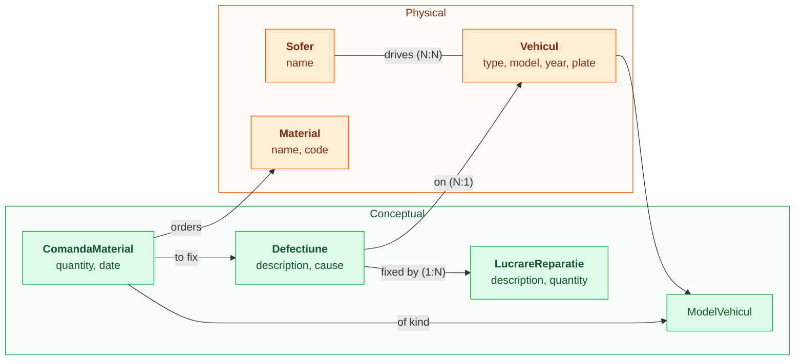

# Data model — conceptual diagram

Entities in the real-world domain only. No documents, spreadsheets, table-rows, or other representation concerns — those live in [logical-model.md](logical-model.md).

Entity names are in Romanian; relationships are in English.

- **Orange** — physical entities: real-world things you can point at.
- **Green** — conceptual entities: things that exist as records of events or specifications, not as physical objects.

