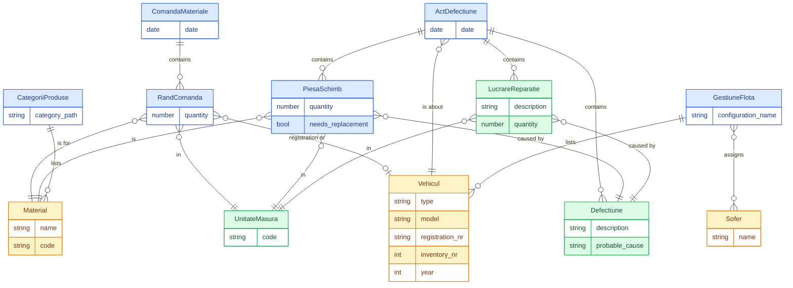

# Data model — conceptual ER diagram

Entity names are in Romanian (matching the documents); relationships are in English.

Entities are colored by kind:

- **Blue** — digital: the `.odt` documents, the source spreadsheets, and the rows inside them that reference real-world things.
- **Amber** — physical: real-world things and master-data lookups (vehicles, materials, drivers).
- **Green** — concepts: abstract notions with no physical referent (units of measure, defect descriptions, work descriptions).

